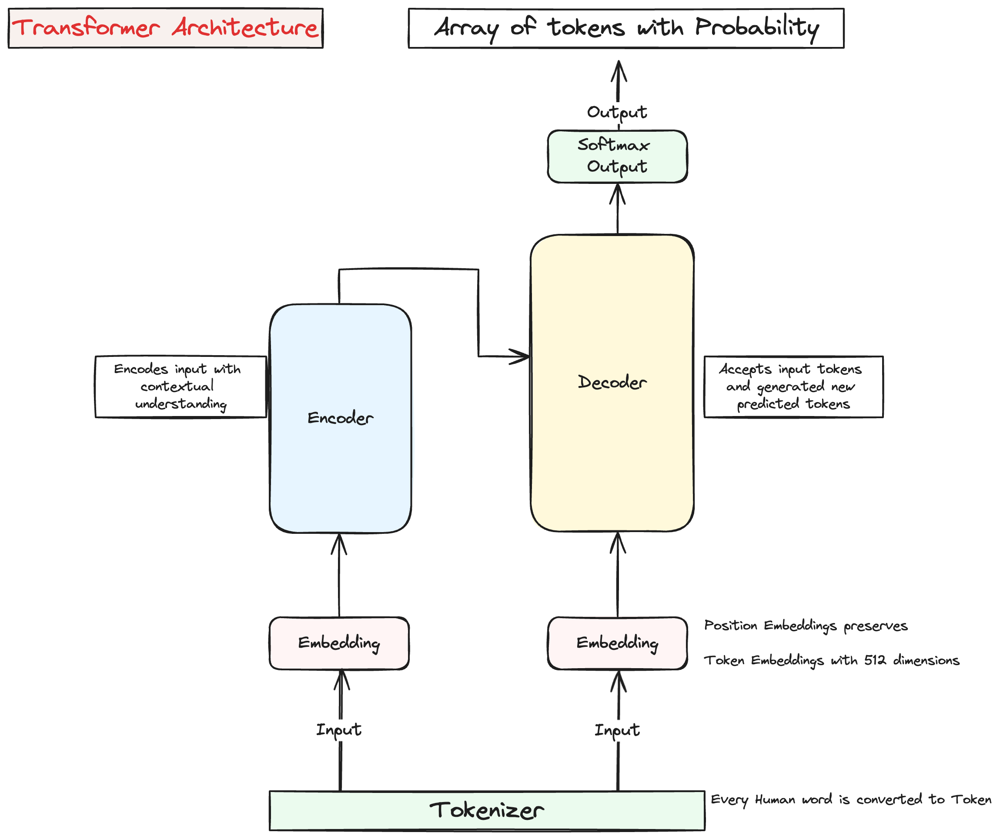

# Transformers and LLMs 

## Life Cycle of a Gen AI Project Lifecycle
1. **Scope - Define the Usecase**
2. **Choose Model**
3. **Adapt and Align Model**
    - **Prompt Engineering**
    - Fine-tuning
    - Align with human feedback
    - Evaluate
4. Application Integration
    - Optimize and deploy model for inference
    - Augment model and build LLM-powered applications

## Text Generation Before Transformers
- **RNN** : 
    - Limitation : To successfully predict required huge scalability
    - Limited understanding of the context 

## Transformer Architecture
- 2017 - Google and U of Toronto published paper on Transformer
- Uses multicore GPUs for parallel training
- Able to learn the relevance and context of all the words in the sentence
- Pays attention to the meaning and context. This attention part is what stands out Transformer architecture. 

### Base Steps:
1. Human words are converted to tokens using a tokenizer
2. These tokens are entered to Vector Embeddings. Vector embedding is a numeric way to represent a word and stores many dimensions. A typical embedding has 512 dimensions
3. The embeddings in addition to token embedding also maintains a position embedding, which is helpful in parallel processing while preserving the spot in the context of the conversation
4. Through self-attention, then model analzes the token that reaches in a sequence   and captures contextual dependencies. This is a training process of the model
5. This attention is done as a **Multi Headed Self-Attention** process, which allows multiple set of attention steps work in parallel independent. The numbers are usually in the range between 12 and 100
6. Each head learns a different attribute about the words 
7. **Feed Forward Network** - In this step vector of logits proportionate to the probability of the tokens
8. This is sent to **Softmax Output** which is a collection of all the words with normalized probabilities
9. The token with the highest probability is returns as the predicted output

### Example Flow
1. A user enters a text to translate from one human language to another such as French to English
2. First all the words are tokenized using the same tokens used for training the model and entered into the Encoder via the embedding cycle described above
3. The Encoder side of the Transformer then learns the context by multi headed self-attention layers and sends to output of encoder
4. Output of encoder goes as input to decoder. The data is a deep representation of structure and meaning. The data is dropped in to the middle of the decoder to start building self-attention learning
5. Next a sequence of tokens are presented to the decoder as input from the bottom. This allows decoder to predict the next token, based on contextual understanding
6. Output from decoder is provided to Softmax out. Thus the first predicted token is received. This goes through in an iteration until all the tokens are sent to Softmax output. 
7. Finally the tokens are detokenized for final output for end user

- **Important** - Not all transformer models are required to use both encoder and decoder. 
- Some models can have just the encoder (classification problem), some just decoder (Llama, GPT) and some use both
- Example:  If encoder only has to analyze the input and does not have to predict anything beyond what is input, for example - classification or sentiment analysis, in those cases only encoder layer is enough and decoder is not required.
- Link to the original article of [Transformer paper by Google](https://arxiv.org/abs/1706.03762)

## Prompt Engineering
- Prompt Engineering is a model where the Model predicts text based on the In-context learning (ICL)
- Prompt Engineering has Four important parts
    - **Prompt** : The ask. Example: Classify this review
    - **In-context Learning (ICL)** : Provide some context or example
        - **Zero shot Inference**: No example given. Large models perform well with this
        - **One shot Inference**: One example is provided along with the prompt
        - **Few shot Inference**: Multiple example with different output classes
    - **Inference** : Model Processing
    - **Completion**: Output that comprises of the original input and the predicted output
- If more examples are not helping, instead of adding more examples, consider finetuning the model
- Models with large number of parameters require zero or less number of examples

## Generative Configuration
- The configuration parameters are invoked during inference time and are different from parameters used during training
- These parameters allow user to limit or cap certain values. Examples:
    - `max new tokens` : number of tokens to be generated at the most
    - `greedy sampling` : prediction picks the term with highest probability. Limitation : suscpetible to repeat words
    - `random sampling` : prediction picks randomly using probability distribution of the term. Example: if a term as probability 0.02 then random sampling will pick up 2% of the time this data
    - `top k sampling` : helps limit random sampling by allowing only allowed number of tokens to be used 
    - `top p sampling` : helps limit random sampling by allowing max. total probability by picking tokens with probability
    - `Temperature` : Controls shape of the probability. Higher the temperature - higher randomness. This is scaling factor applied at final layer of Softmax layer to pick the next token based on probability distribution. In contranst to top k or top p, with low temperature setup it picks random sampling and outputs the highest probability. With high temperature it picks wider probability distribution 

## Generative AI Project Life Cycle
1. **Define Usecase** : Example: Summarization, Translation, Single Task, Invoke APIs 
2. **Choose Model** : Choose pretrained model or train a model yourself
3. **Adapt and Align Model** : 
    - Prompt Engineering
    - Fine-tuning
    - Align with human feedback
    - Evaluate
4. **Optimize and Deploy for Inference**
5. **Additional Infrastructure of Dependency**

## LLM Pretraining Process

### Input Data Selection
- Input is at PB level of unstructured data such as scraping web etc
- Model internalizes pattern from the language
- Model weights are adjusted to minimize error
- All the tokenized strings are converted to Vector Embedding
- Data quality filter is applied on the input data to ensure accuracy, filter out harmful info. As a result about 1 - 3% data from publicly available unstructured data is used

### Tranformer Choices
| Attribute | Encoder Only | Decoder Only (most common) | Both Encoder Decoder | 
| --- | --- | --- | --- |
| Also Known As | Autoencoding Models | | Translation | 
| Trained With | Masked Language Modeling (MLM) | Causal Language Modeling (CLM) | Sequence to Sequence Model |
| Core Concept | Bidirectional Context | Unidirectional Context | Span Corruption* | 
| Key Objective | Reconstruct Text | Predict Next Token | Reconstruct Span |
| Use cases | Sentiment Analysis, Named Entity Recognization, Word Classification | Text Generation | Translation, Summarization, Question Answer |
| Known Models | BERT, ROBERTA  | GPT, LlaMa, BLOOM | T5, BART |
 
- **Span Corruption** : is a modeling technique where random sequences of input tokens are masked. These mask tokens are replaced with Sentinel tokens. Sentinel tokens are special tokens placed as replacements of words, but these do not mean any words by themselves. The model then auto generates the masked words. The output is the Sentinel token followed by the predicted texts for the masked words.   

## Challenges of Models
- **GPU Needs** : Models require more GPU that is proportionate to number of parameters and the factor of accuracy. Following are the factors that directly influence the GPU requirements.
    - `Model Parameters (Weights) : 4 bytes / parameter` (1B parameters -> 4GB)
    - `Adam Optimizer : 8 bytes / parameter`
    - `Gradients : 4 bytes / parameter`
    - `Activations (Temporary Memory) : 8 bytes / parameter`
- Thus though the model parameters need only 4 bytes, it requires almost 20 extra bytes for other things. For example to train with 1B parameters total GPU memory needed is 24GB 

### Quantization - Scaling Process
- This is a Scaling process where the memory requirement is reduced by reducing accuracy. Such as instead of storing a number as 32 bit floating point, store it as 16 bit or 8 bit
- GPU requirement can be reduced by half with Quantization even though all the models can have same number of parameters
- BFLOAT16 is a model that is preferred as it is space saver similar to that of 16 bit as well as the accuracy is similar to that of 32 bits  
- Order of memory requirements : **FP32** (4 bytes) > **BFLOAT16** (2 bytes) = **FP16** (2 bytes) > **Integer** (1 byte)

### Parallel Processing via Distributed GPUs
- This is a process where parallel processing of data is done via distributed GPUs, thus leveraging a more cost effective option of horizontal scaling of computing resource in contrast to vertical scaling
 
#### Distributed Data Parallel (DDP) by PyTorch
- Batch of data copied to multiple GPUs that has the LLM available on each
- Each data set is processed in parallel as forward and backward pass 
- After that a synchronization process runs to combine outputs of each GPU
- After that each GPU's Model is updated identically
- **Important** - This approach requires all of Model weights (aka parameters), Gradients and Adam optimizers to be available in each of the GPUs, thus requiring additional redundant storage in each GPU. The only optimization is happening on saving space on data side due to batching of data

#### Fully Sharded Data Parallel (FSDP) by PyTorch
- This approach in addition to distributing data in batches similar to that of DDP, it distributes model parameters, graidents and optimizers across multiple GPUs, thus addresses the need for redundant memory case as described above in DDP approach
- The synchronization step remains same as that of DDP
- Mechanics:
    - **Stage 1**: Shards Optimizer States across GPUs. Reduces memory foot print by 4X
    - **Stage 2**: Shards Gradient across GPUs. Reduces memory foot print by another 2X
    - **Stage 3**: Shards Parameters across GPUs. Memory foot print reduction is dependent on number of GPUs used. Count of GPUs is the times of reduction
- Overall memory optimization comes with a trade off with performance, since synchronization and communication between GPUs would create more delay

### Scaling Choices
- To maximize performance (Minimize Loss) of a model, 3 main levers play a role:
1. Training Data Size
2. Number of Parameters
3. Computing Resource cost (GPU)
- Similar to CAP theorem not everything can be achieved once. So to maximize performance two or less of the factors can be focussed upon
- **Unit of Compute** : Usually represented as 1 Peta-FLOP per day. FLOP is floating point operations
- This is equivalent of 8 NVIDIA V100 GPUs working in parallel or 2 NVIDIA A100 GPUs
- For a perspective if a model that has about 3B parameter uses about 100 Petaflop GPU per day to pretrain, a GPT-3 like model which has 175B parameters may take close to 3700 Petaflop GPUs
- **Chinchilla Model** : Research papers Provides optimum number of parameters and training data volume given a set of computing constraint
    - Data size should be 20 times more than Number of Parameters: `Training Data = 20 x Parameters`
    - LlaMa and Bloomberg GPT are few models those are designed after Chinchilla research

### Pre-training for Domain Adaptation
- If the domain has a niche set of language, for example specific to law practice or medical practice etc. then it is important to pre-train the model using own training data instead of relying on available data from general public domain
- Example BloombergGPT was pre-trained using domain specific data of 51% of financial data and 49% publicly available data. This model also follows Chinchilla recommendation for count of training data and parameters

- To know more more about Fine tuning LLM, continue with following section
## Finetuning LLMs
[fine-tune-llms.md](./fine-tune-llms.md)

