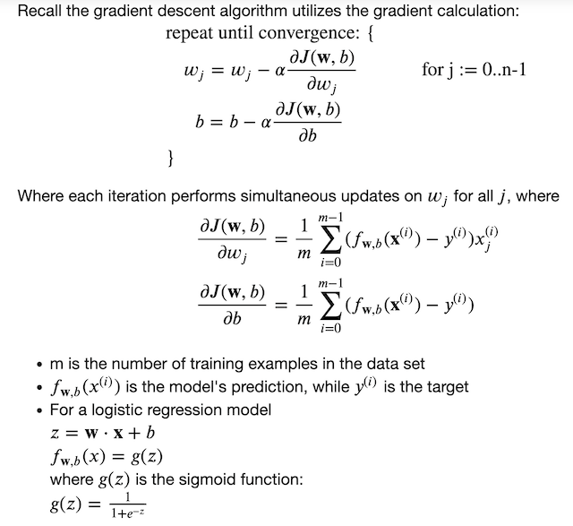

# Linear Regression and Logistics Regression

### Basics 

- In Linear Regression and Logistic Regression 4 basic steps are followed
1. Find Prediction aka **Regression Equation** that takes the shape of `f(x) = mx + b`
2. From Regression Equation Find **Cost Function**
3. From Cost Function, Find **Gradient Derivative** to understand how cost function gets minimized
4. From Gradient Derivative, apply learning rate and run multiple iterations to final optimal values of parameters w,b using **Gradient Descent Function**

- Using the final parameter values w,b the prediction gets more accurate

## Linear Regression
- This is the most fundamental model to learn.
- The equation takes form of a linear equation in the form of `f(x) = mx + b`
- A equation with multiple features looks like this : `f(x) = m0*x0 + m1*x1 + m2*x2 ...mi*xi + b`
- The above can efficiently done by direct vector multiplication of Python called **dot** method : `numpy.dot(m,x) + b`

### Cost Function
- Cost function provides feedback on how accurate is the model or the function used to predict. The minimum value of cost function is the goal
- While the model is represented as a functiono such as y = mx + c, the cost function is a function of m, which in other case measures the accuracy of value of the coefficient. The smaller the value of cost function, better choice of coefficient it is 
- Cost function implementation is [here](./linear-regression/CostFunction.py)

### Gradient Descent
- It is a more general function to minimize cost compared to Cost Function which is more. This function gradually explores the direction to progress to achieve minimum value of cost function
- Gradiesnt Descent is a function that allows a factor called Learning rate to improve on computed cost function in the previous step
- Important to remember is that the coefficients are updated simultaneously, which means the updated value of one coefficient should not be applied to the same round of computation of another coefficient
- Gradient Descent implementation is [here](./linear-regression/CostFunction.py) 

#### Learning Rate
- Is a small number by which the grdient descent shifts with every step
- If Learning Rate is too small, then the process takes long time but high chances of finding the right minimum
- If Learning Rate is too large, then there is a chance it will overshoot the minimum and will never converge on the solution
- To test out if the learning rate is converging start with a small value of learning rate such as 0.001, then change to 0.01 then to 0.1 etc. until the learning rate shows less and less value of gradient descent

#### Derivate of Coefficients
- Derivate of coefficient provides position of slope of cost function at a given point, thus showing whether it is getting closer to minimum value of drifting away from it

#### Vectorization of Features
- In multi regression where multiple features are present, it is more efficient to apply vector multiplication methods such as `numpy.dot()` instead of running loops to process elements in an iterative way

### Feature Scaling
- Many times the type of numbers each feature is evaluated upon can drastically vary, thus causing gradient descent to converge slowly. To avoid this feature scaling is done
- Thus a comfortable feature scale is something between `-1 < x < 1` range
- Typical approach to feature scaling is 
  - Mean Normalization
  - Z Score Normalization
- **Mean Normalization**: Subtract the feature value from the mean feature value and divide by the range of the feature value
- **Z Score Normalization** : Subtract the feature value from the mean feature value and divide by the Standard Deviation of the feature value

### Feature Engineering
- Combining or dropping some features to make a new feature to enhance the learning rate and get a higher accuracy in prediction

### Polynomial Regression
- When the features increase by degrees such as : `f(x) = w1x + w2x**2 + w3x**3 + w4x**0.5 ...`

## Logistic Regression aka Classification
- Sigmoid function is the equivalent of linear regression equation. It is also known as Logistic Function

### Decision Boundary for Logistic Regression
- Decision Boundary is the probability at which a decision is made to consider the cutoff for a result as positive or negative
- Example: In a more sensitive case, a probability of 0.8 or higher could be consider as positive and in a less sensitive case, a probability of 0.5 or higher can be considered as a Positive result 
- In Logistic Regression z =(w.x + b) if >= 0 then y = 1 otherwise 0 

### Cost Function of Logistic Regression
- Squared Error Cost used in Linear Regression would not converge into forming a convex arc in case of Logistic Regression, hence it would not find a global minimum
- Thus Logistic Regression uses a different method to find cost 

### Gradient Descent of Logistic Regression
- Gradient Descent gradually adjusts the cost function by changing w and b to finally bring the cost to minimum
- Similar in structure to that of linear regression

## Using Python for Machine Learning
- Python is the choice of language for Data Science
- [Read More](./python.md)

